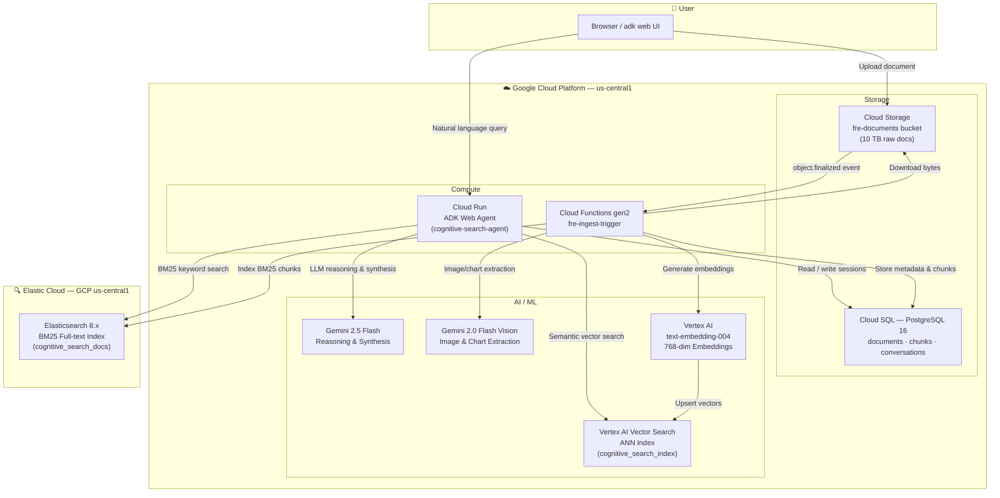
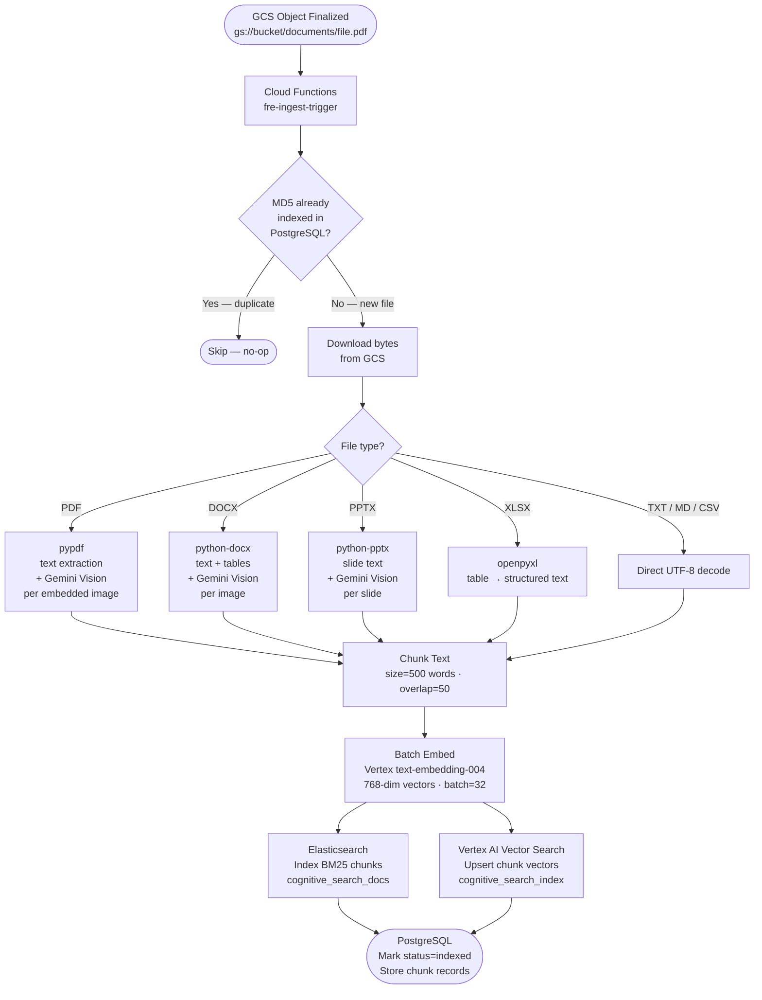
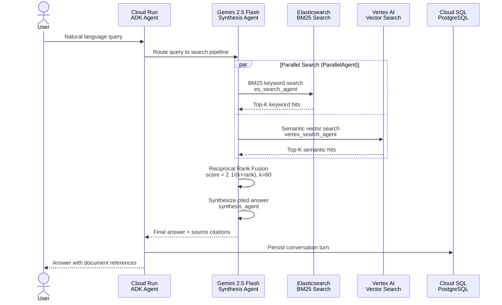

# GCP Account Setup Plan — FRE_GCP_v1.0

## Overview
After receiving GCP access, provision 4 GCP services (GCS, Cloud SQL, Vertex AI, Cloud Run/Functions), wire up Elastic Cloud, fill in `.env`, then run local and cloud smoke tests. Expect ~2-3 hours total.

---

## Phase 1 — Authentication & Project Verification

**Step 1.** Install `gcloud` CLI if not already: https://cloud.google.com/sdk/docs/install

**Step 2.** Authenticate and set your project:
```bash
gcloud auth login
gcloud config set project YOUR_PROJECT_ID
gcloud auth application-default login   # needed for Vertex AI + Cloud SQL Connector
```

**Step 3.** Verify your IAM roles — you need at minimum:
- `roles/storage.admin` (GCS)
- `roles/cloudsql.admin` (Cloud SQL)
- `roles/aiplatform.admin` (Vertex AI)
- `roles/run.admin` (Cloud Run)
- `roles/cloudfunctions.admin` (Cloud Functions)

Check with:
```bash
gcloud projects get-iam-policy YOUR_PROJECT_ID \
  --flatten="bindings[].members" \
  --filter="bindings.members:YOUR_EMAIL"
```

---

## Phase 2 — Enable Required APIs

**Step 4.** Enable all needed APIs at once:
```bash
gcloud services enable \
  storage.googleapis.com \
  sqladmin.googleapis.com \
  aiplatform.googleapis.com \
  run.googleapis.com \
  cloudfunctions.googleapis.com \
  cloudbuild.googleapis.com \
  secretmanager.googleapis.com
```

---

## Phase 3 — Cloud Storage (GCS Bucket)

**Step 5.** Create the document bucket:
```bash
gsutil mb -l us-central1 gs://fre-documents-YOUR_PROJECT_ID
gsutil versioning set on gs://fre-documents-YOUR_PROJECT_ID
```

**Step 6.** Set in `.env`:
```
GCS_BUCKET=fre-documents-YOUR_PROJECT_ID
```

**Step 7.** Test upload a sample PDF:
```bash
gsutil cp sample.pdf gs://fre-documents-YOUR_PROJECT_ID/documents/sample.pdf
```

---

## Phase 4 — Cloud SQL (PostgreSQL)

**Step 8.** Create the instance:
```bash
gcloud sql instances create fre-db \
  --database-version=POSTGRES_16 \
  --tier=db-f1-micro \
  --region=us-central1 \
  --storage-auto-increase
```

**Step 9.** Create the database and set the password:
```bash
gcloud sql databases create cognitive_search --instance=fre-db
gcloud sql users set-password postgres --instance=fre-db --password=YOUR_SECURE_PASSWORD
```

**Step 10.** Get the instance connection name:
```bash
gcloud sql instances describe fre-db --format="value(connectionName)"
# Output: your-project:us-central1:fre-db
```

**Step 11.** Set in `.env`:
```
POSTGRES_HOST=localhost
POSTGRES_PASSWORD=YOUR_SECURE_PASSWORD
CLOUD_SQL_INSTANCE=your-project:us-central1:fre-db
```

> The schema (`documents`, `chunks`, `conversations` tables) is auto-created on first run by `init_db()` in `storage/postgres.py` — no SQL scripts needed.

---

## Phase 5 — Elastic Cloud (Elasticsearch)

**Step 12.** Go to https://cloud.elastic.co → create a deployment in `GCP us-central1`.

**Step 13.** Go to **Security → API Keys → Create API Key**. Copy the encoded key.

**Step 14.** Copy the Cloud endpoint URL from the deployment overview:
- Format: `https://<id>.es.us-central1.gcp.cloud.es.io:443`

**Step 15.** Set in `.env`:
```
ELASTICSEARCH_URL=https://<id>.es.us-central1.gcp.cloud.es.io:443
ELASTICSEARCH_API_KEY=<your-base64-api-key>
```

> The ES index (`cognitive_search_docs`) is auto-created on first `index_chunks()` call in `search/es_index.py`.

---

## Phase 6 — Vertex AI Vector Search Index *(Most Complex — Allow 30-60 min)*

**Step 16.** Create the index:
```bash
gcloud ai indexes create \
  --display-name=fre-cognitive-search-index \
  --metadata-file=- \
  --region=us-central1 << 'EOF'
{
  "contentsDeltaUri": "gs://fre-documents-YOUR_PROJECT_ID/index-data/",
  "config": {
    "dimensions": 768,
    "approximateNeighborsCount": 150,
    "distanceMeasureType": "DOT_PRODUCT_DISTANCE",
    "algorithmConfig": {
      "treeAhConfig": {}
    }
  }
}
EOF
```

**Step 17.** Create an Index Endpoint and deploy the index:
```bash
# Create endpoint
gcloud ai index-endpoints create \
  --display-name=fre-search-endpoint \
  --region=us-central1

# Deploy index to endpoint (use IDs from output above)
gcloud ai index-endpoints deploy-index ENDPOINT_ID \
  --deployed-index-id=cognitive_search_index \
  --display-name=fre-deployed-index \
  --index=INDEX_ID \
  --region=us-central1
```

**Step 18.** Get the full resource names and set in `.env`:
```bash
gcloud ai indexes list --region=us-central1
gcloud ai index-endpoints list --region=us-central1
```
```
VERTEX_AI_INDEX_NAME=projects/NUMBER/locations/us-central1/indexes/INDEX_ID
VERTEX_AI_INDEX_ENDPOINT=projects/NUMBER/locations/us-central1/indexEndpoints/ENDPOINT_ID
VERTEX_AI_DEPLOYED_INDEX_ID=cognitive_search_index
```

---

## Phase 7 — Complete Your `.env` File

Copy `.env.example` to `.env` and fill in all values from Phases 3–6:
```bash
cp .env.example .env
```

Remaining values to set:
```
GCP_PROJECT=your-project-id
GCP_REGION=us-central1
GOOGLE_API_KEY=AIza...   # From https://aistudio.google.com
GEMINI_MODEL=gemini-2.5-flash
GEMINI_VISION_MODEL=gemini-2.0-flash
VERTEX_EMBEDDING_MODEL=text-embedding-004
VERTEX_EMBEDDING_DIM=768
```

---

## Phase 8 — Local Development Smoke Test *(run during Phase 6 wait)*

**Step 19.** Start local services:
```bash
cd FRE_GCP_v1.0
docker compose up -d    # starts postgres + elasticsearch locally
```

**Step 20.** Install deps and run the agent:
```bash
python -m venv .venv
.venv\Scripts\activate
pip install -r requirements.txt
adk web                 # visit http://localhost:8000/dev-ui
```

**Step 21.** Test ingestion:
- Ask the agent: *"Index the file gs://YOUR_BUCKET/documents/sample.pdf"*
- Verify PostgreSQL has a row in the `documents` table
- Verify ES has documents: `curl http://localhost:9200/cognitive_search_docs/_count`

---

## Phase 9 — Cloud Run Deployment

**Step 22.** Deploy the ADK agent:
```bash
gcloud run deploy cognitive-search-agent \
  --source . \
  --region us-central1 \
  --allow-unauthenticated \
  --memory 2Gi \
  --set-env-vars="GCP_PROJECT=...,GCS_BUCKET=...,POSTGRES_PASSWORD=...,CLOUD_SQL_INSTANCE=...,ELASTICSEARCH_URL=...,ELASTICSEARCH_API_KEY=...,VERTEX_AI_INDEX_ENDPOINT=...,VERTEX_AI_INDEX_NAME=...,GEMINI_MODEL=gemini-2.5-flash"
```

**Step 23.** Get the deployed URL:
```bash
gcloud run services describe cognitive-search-agent --region us-central1 --format="value(status.url)"
```

---

## Phase 10 — Cloud Functions (Auto-Ingest on GCS Upload)

**Step 24.** Deploy the GCS trigger (`ingestion/gcs_trigger.py`):
```bash
gcloud functions deploy fre-ingest-trigger \
  --gen2 \
  --runtime=python312 \
  --region=us-central1 \
  --entry-point=process_gcs_event \
  --trigger-event-filters="type=google.cloud.storage.object.v1.finalized" \
  --trigger-event-filters="bucket=YOUR_BUCKET_NAME" \
  --memory=2Gi \
  --timeout=540s \
  --set-env-vars="GCP_PROJECT=...,CLOUD_SQL_INSTANCE=...,ELASTICSEARCH_URL=...,ELASTICSEARCH_API_KEY=...,VERTEX_AI_INDEX_ENDPOINT=...,VERTEX_AI_INDEX_NAME=..."
```

---

## Phase 11 — End-to-End Test

**Step 25.** Upload a real PDF and watch auto-ingest:
```bash
gsutil cp test_doc.pdf gs://YOUR_BUCKET/documents/test_doc.pdf
# Cloud Function triggers automatically — check logs:
gcloud functions logs read fre-ingest-trigger --region=us-central1
```

**Step 26.** Query via Cloud Run URL or `adk web`:
- Ask: *"What are the main topics in test_doc.pdf?"*
- Expected: A cited answer with content extracted from the document

---

## Key Files Reference

| File | Purpose |
|------|---------|
| `.env.example` | Template for all config values |
| `config.py` | How env vars map to Python constants |
| `docker-compose.yml` | Local dev stack (postgres + elasticsearch) |
| `storage/postgres.py` | `init_db()` auto-creates schema on first run |
| `search/es_index.py` | Auto-creates Elasticsearch index on first write |
| `ingestion/pipeline.py` | Full ingestion orchestrator |
| `ingestion/gcs_trigger.py` | Cloud Functions entry point |
| `Dockerfile` | Cloud Run container definition |

---

## Decisions & Notes

- Elastic Cloud managed (not self-hosted) — simpler, no VM to manage
- Vertex AI index deploy takes ~30-60 min — do Phase 8 local dev during the wait
- Schema and ES index are auto-created by code — no manual SQL scripts needed
- `GOOGLE_API_KEY` from AI Studio works for local dev; Cloud Run uses ADC automatically

## Key Risk

**IAM permissions** — if you receive a limited service account instead of Owner/Editor, Steps 16-18 (Vertex AI index creation) may fail. In that case, ask your admin to run those `gcloud ai` commands and give you the resulting resource names to plug into `.env`.

---

## Architecture Diagrams

### 1. Overall System Architecture



---

### 2. Document Ingestion Pipeline



---

### 3. Query / Search Flow


